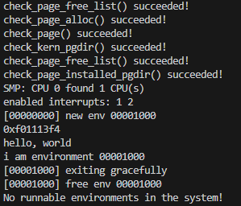

# sched

Lugar para respuestas en prosa, seguimientos con GDB y documentación del TP.

## Parte 1: Cambio de contexto

# Kernel Mode-> User Mode
-TODO: depuracion GDB.

# User Mode-> Kernel Mode
-"Ejecutar el kernel con qemu y validar que las syscalls están funcionando"
